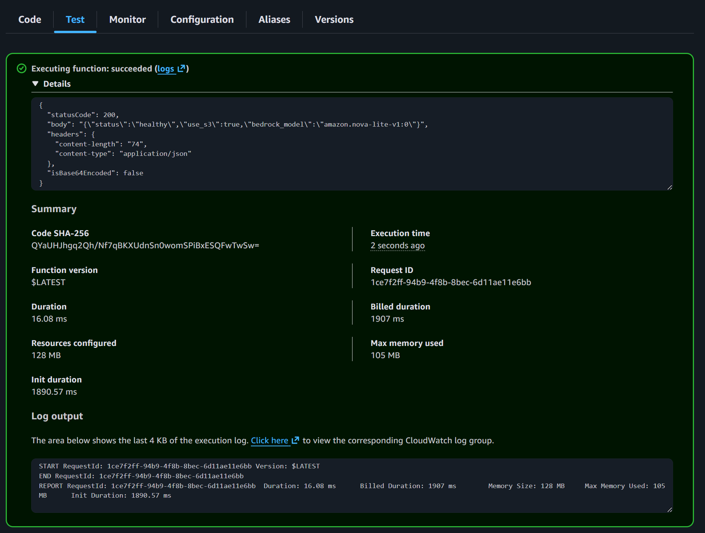

# 🤖 Transition Your Digital Twin to AWS Bedrock

This branch covers **migrating your Digital Twin backend from OpenAI to AWS Bedrock**, updating **IAM permissions**, **backend code**, and **Lambda configuration**, then **testing and monitoring** your Bedrock-powered deployment end to end.

Everything below follows your usual style: clear steps, inline code blocks, and image placement exactly where referenced, with **no horizontal rule lines**.

## Part 1: Configure IAM Permissions

### Step 1: Sign In as Root User

Because we are modifying IAM permissions, start from the root account:

1. Go to the AWS homepage: [https://aws.amazon.com](https://aws.amazon.com)
2. Sign in using your **root user** credentials

### Step 2: Add Bedrock and CloudWatch Permissions to User Group

1. In the AWS Console, search for **IAM**
2. In the left sidebar, click **User groups**
3. Click on **TwinAccess** (the group created on Day 2)
4. Open the **Permissions** tab → click **Add permissions** → **Attach policies**
5. Search for and select these policies:

   * `AmazonBedrockFullAccess` – allows access to Bedrock AI services
   * `CloudWatchFullAccess` – allows creating dashboards and viewing metrics
6. Click **Attach policies**

Your `TwinAccess` group should now have:

* `AWSLambda_FullAccess`
* `AmazonS3FullAccess`
* `AmazonAPIGatewayAdministrator`
* `CloudFrontFullAccess`
* `IAMReadOnlyAccess`
* **`AmazonBedrockFullAccess` (new!)**
* **`CloudWatchFullAccess` (new!)**
* **`AmazonDynamoDBFullAccess` (VERY new!)**

That last one was a catch by student **Andy C** – without `AmazonDynamoDBFullAccess`, you may hit a permissions error in Day 5.

### Step 3: Sign Back In as IAM User

1. Sign out of the root account
2. Sign back in as your IAM user, for example `aiengineer`, with the IAM credentials

## Part 2: Update Your Code for Bedrock

### Step 1: Update Requirements

Update `twin/backend/requirements.txt` and remove the `openai` package, since it is no longer used:

```text
fastapi
uvicorn
python-dotenv
python-multipart
boto3
pypdf
mangum
```

Note: `openai` has been removed from the requirements.

### Step 2: Update the Server Code

Replace your existing `twin/backend/server.py` with the new **Bedrock-powered** version you just implemented.

#### Key Changes Explained

1. **Removed OpenAI import**

   * No more `from openai import OpenAI`

2. **Added Bedrock client**

   * Uses `boto3.client("bedrock-runtime", ...)` to talk to AWS Bedrock

3. **New `call_bedrock` function**

   * Handles Bedrock’s message format and wraps the `converse` API

4. **Model selection via environment variable**

   * `BEDROCK_MODEL_ID` allows easy switching between Nova models without code changes

5. **Improved error handling**

   * Clean mapping of Bedrock errors (e.g. `ValidationException`, `AccessDeniedException`) into FastAPI `HTTPException` responses

## Part 3: Deploy to Lambda

### Step 1: Update Lambda Environment Variables

1. In the AWS Console, go to **Lambda**

2. Click on your `twin-api` function

3. Open **Configuration** → **Environment variables**

4. Click **Edit**

5. Add these new variables:

   * Key: `DEFAULT_AWS_REGION` | Value: `us-east-1` (or your chosen region)
   * Key: `BEDROCK_MODEL_ID` | Value: `amazon.nova-lite-v1:0`

     Remember: this model ID might need a `us.` or `eu.` prefix if you see a Bedrock error.

6. You can now remove `OPENAI_API_KEY` since the OpenAI API is no longer used

7. Click **Save**

### Model ID Options

You can set `BEDROCK_MODEL_ID` to one of the following (with a possible `us.` or `eu.` prefix, as described in the Heads Up at the top of the material):

* `amazon.nova-micro-v1:0` – fastest and cheapest
* `amazon.nova-lite-v1:0` – balanced (recommended)
* `amazon.nova-pro-v1:0` – most capable but more expensive

### Step 2: Add Bedrock Permissions to Lambda

Your Lambda execution role must also have permission to call Bedrock:

1. In the Lambda console, open **Configuration** → **Permissions**
2. Click the execution role name to open it in IAM
3. Click **Add permissions** → **Attach policies**
4. Search for and select: `AmazonBedrockFullAccess`
5. Click **Add permissions**

### Step 3: Rebuild and Deploy Lambda Package

Because `requirements.txt` has changed, rebuild the deployment package with the updated dependencies:

```bash
cd backend
uv add -r requirements.txt
uv run deploy.py
```

This will create a fresh `lambda-deployment.zip` that includes the Bedrock dependencies.

### Step 4: Upload to Lambda via S3 (Recommended)

Uploading via S3 is more reliable, especially for larger packages or slower connections.

**Mac/Linux:**

```bash
# Load environment variables
source .env

# Navigate to backend
cd backend

# Create a unique S3 bucket name for deployment
DEPLOY_BUCKET="twin-deploy-$(date +%s)"

# Create the bucket
aws s3 mb s3://$DEPLOY_BUCKET --region $DEFAULT_AWS_REGION

# Upload your zip file to S3
aws s3 cp lambda-deployment.zip s3://$DEPLOY_BUCKET/ --region $DEFAULT_AWS_REGION

# Update Lambda function from S3
aws lambda update-function-code \
    --function-name twin-api \
    --s3-bucket $DEPLOY_BUCKET \
    --s3-key lambda-deployment.zip \
    --region $DEFAULT_AWS_REGION

# Clean up: delete the temporary bucket
aws s3 rm s3://$DEPLOY_BUCKET/lambda-deployment.zip
aws s3 rb s3://$DEPLOY_BUCKET
```

**Windows (PowerShell), starting in the project root:**

```powershell
# Load environment variables from .env
Get-Content .env | ForEach-Object {
    if ($_ -match '^([^=]+)=(.*)$') {
        [System.Environment]::SetEnvironmentVariable($matches[1], $matches[2], 'Process')
    }
}

# Navigate to backend
cd backend

# Create a unique S3 bucket name for deployment
$timestamp = Get-Date -Format "yyyyMMddHHmmss"
$deployBucket = "twin-deploy-$timestamp"

# Create the bucket
aws s3 mb s3://$deployBucket --region $env:DEFAULT_AWS_REGION

# Upload your zip file to S3
aws s3 cp lambda-deployment.zip s3://$deployBucket/ --region $env:DEFAULT_AWS_REGION

# Update Lambda function from S3
aws lambda update-function-code `
    --function-name twin-api `
    --s3-bucket $deployBucket `
    --s3-key lambda-deployment.zip `
    --region $env:DEFAULT_AWS_REGION

# Clean up: delete the temporary bucket
aws s3 rm s3://$deployBucket/lambda-deployment.zip
aws s3 rb s3://$deployBucket
```

**Alternative: Direct Upload (fast, stable connections only)**

```bash
aws lambda update-function-code \
    --function-name twin-api \
    --zip-file fileb://lambda-deployment.zip \
    --region $DEFAULT_AWS_REGION
```

The S3 method is recommended because:

* S3 uploads can resume if interrupted
* Lambda pulls directly from S3 (faster than pushing via CLI)
* Plays nicer with VPNs and corporate firewalls
* More reliable for packages over ~10 MB

Wait for the update to complete. In the Lambda console, you should see `"LastUpdateStatus": "Successful"`.

### Step 5: Test the Lambda Function

1. In the Lambda console, open the **Test** tab
2. Use your existing `HealthCheck` test event
3. Click **Test**
4. Check the response — it should now include the Bedrock model in the body:

```json
{
  "statusCode": 200,
  "body": "{\"status\":\"healthy\",\"use_s3\":true,\"bedrock_model\":\"amazon.nova-lite-v1:0\"}"
}
```



## Part 4: Test Your Bedrock-Powered Twin

### Step 1: Test via API Gateway

Test the health endpoint directly in your browser:

```text
https://YOUR-API-ID.execute-api.us-east-1.amazonaws.com/health
```

You should see JSON that includes the `bedrock_model` field, confirming that the Bedrock backend is wired in correctly.

### Step 2: Test via CloudFront

1. Open your CloudFront URL:

   ```text
   https://YOUR-DISTRIBUTION.cloudfront.net
   ```

2. Start a conversation with your Digital Twin

3. Confirm that messages are being sent and responses are returned successfully

4. Verify that responses look sensible and that memory continues to work as expected

## Part 5: CloudWatch Monitoring

Now that your Twin is powered by Bedrock, set up monitoring to track usage, latency, and cost.

### Step 1: View Lambda Metrics

1. In the AWS Console, go to **CloudWatch**
2. Click **Metrics** → **All metrics**
3. Click **Lambda** → **By Function Name**
4. Select your `twin-api` function
5. Inspect these key metrics:

   * ✅ **Invocations**
   * ✅ **Duration**
   * ✅ **Errors**
   * ✅ **Throttles**

### Step 2: View Bedrock Metrics

1. In CloudWatch Metrics, click **AWS/Bedrock**
2. Choose **By Model Id**
3. Select your Nova model
4. Monitor:

   * **InvocationLatency** – model response time
   * **Invocations** – number of Bedrock calls
   * **InputTokenCount** – tokens sent to the model
   * **OutputTokenCount** – tokens generated by the model

### Step 3: View Lambda Logs

1. In CloudWatch, click **Log groups**

2. Open:

   ```text
   /aws/lambda/twin-api
   ```

3. Click on the latest log stream

4. You will see:

   * Each Lambda invocation
   * Any Bedrock-related log messages
   * Errors and stack traces
   * Execution times

### Step 4: Create a CloudWatch Dashboard (Optional)

Build a simple dashboard to watch everything at a glance:

1. In CloudWatch, go to **Dashboards** → **Create dashboard**
2. Name it: `twin-monitoring`
3. Add widgets:

**Widget 1: Lambda Invocations**

* Type: Line
* Metric: Lambda → `twin-api` → `Invocations`
* Statistic: Sum
* Period: 5 minutes

**Widget 2: Lambda Duration**

* Type: Line
* Metric: Lambda → `twin-api` → `Duration`
* Statistic: Average
* Period: 5 minutes

**Widget 3: Lambda Errors**

* Type: Number
* Metric: Lambda → `twin-api` → `Errors`
* Statistic: Sum
* Period: 1 hour

**Widget 4: Bedrock Invocations**

* Type: Line
* Metric: AWS/Bedrock → your model → `Invocations`
* Statistic: Sum
* Period: 5 minutes

### Step 5: Set Up Cost Monitoring

Monitor how much your Twin costs to run:

1. Open **AWS Cost Explorer** in the console
2. Click **Cost Explorer** → **Launch Cost Explorer**
3. Filter by:

   * Service: **Bedrock**
   * Time range: **Last 7 days**
4. Review how your Bedrock usage is accumulating cost over time

### Step 6: Create a Billing Alert (Recommended)

1. In the AWS Console, search for **Billing**
2. Click **Budgets** → **Create budget**
3. Choose **Cost budget**
4. Configure:

   * Budget name: `twin-budget`
   * Monthly budget: e.g. `$10` (or your preferred limit)
   * Alert threshold: 80% of the budget
5. Enter your email for notifications
6. Click **Create budget**

You now have a **Bedrock-powered Digital Twin** with:

* Correct IAM + Lambda permissions
* Updated backend code and dependencies
* Verified API Gateway + CloudFront integration
* Basic observability and cost controls via CloudWatch and Billing
